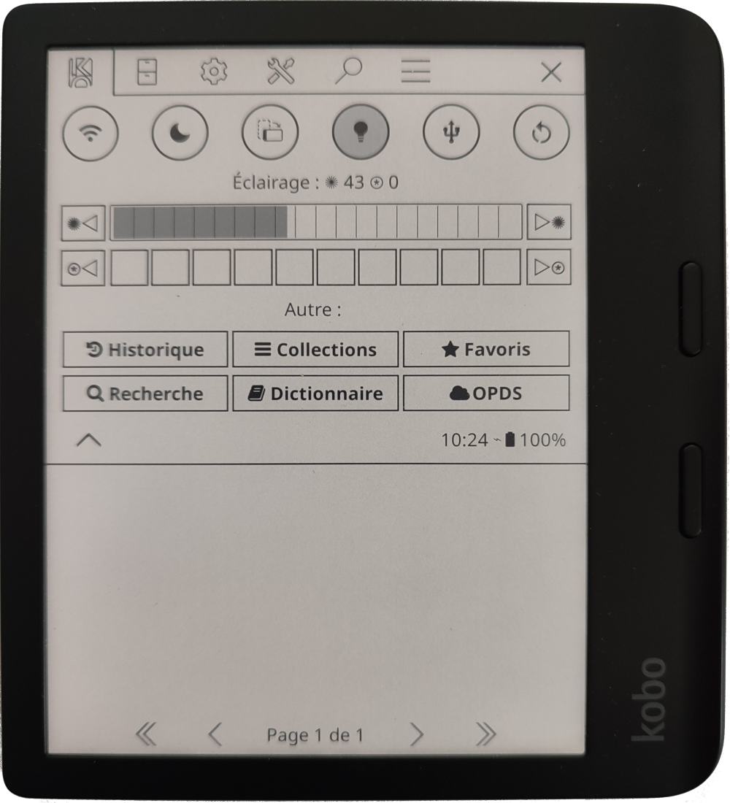
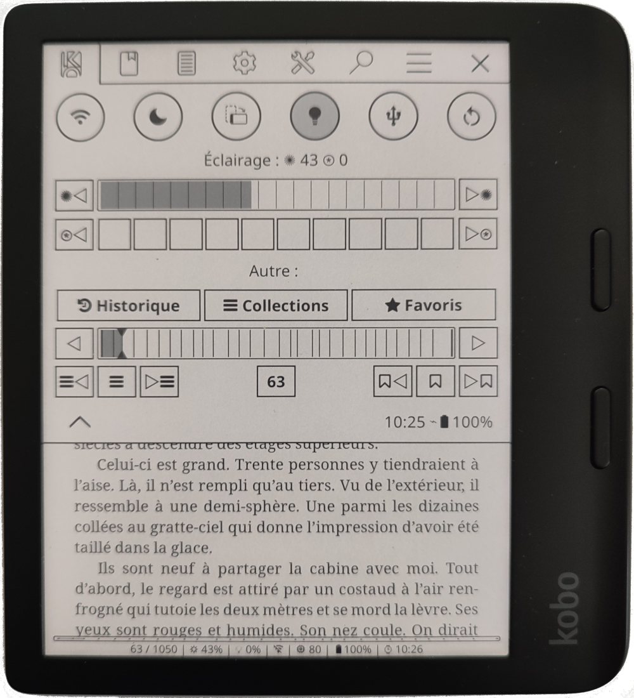
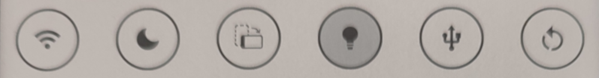
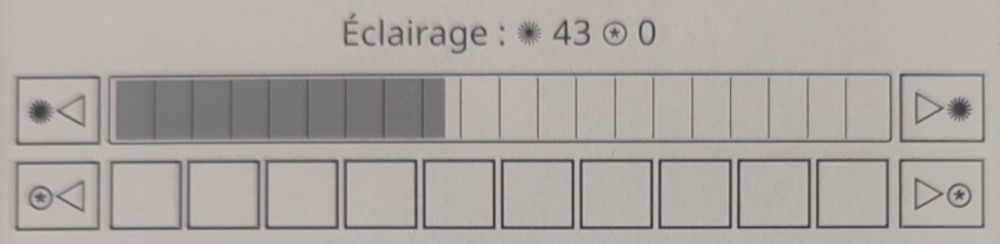
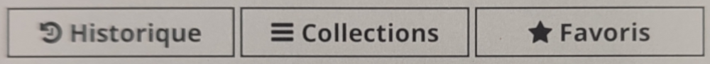
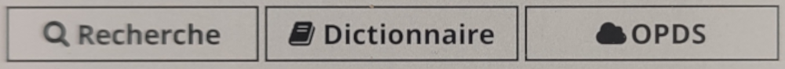
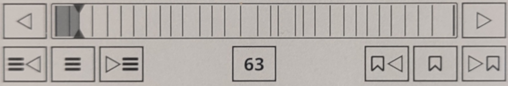
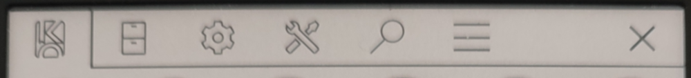
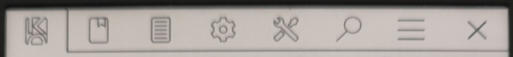

# koreader-quick-settings-advanced

Advanced version of quick-settings patch from qewer33. Mix of personnal and others forks ideas.

**In filemanager :**

**In reader :**

## Installation

Drop the `patches/***.lua` files into your `koreader/patches/` directory. Place all the icons in the `icons/` folder in your KOReader `icons/` directory.

## Patches

# 2-quick-settings.lua
  
Adds a Quick Settings tab as the first tab in the KOReader top menu. Provides fast access to common actions and device controls without navigating through menus. - Active buttons show a light gray fill indicator
- Works in both File Manager and Reader views

**Actions :**

Circular buttons that show a light gray fill indicator when active :

- Wi-Fi (shows connected SSID, active indicator when connected). Tap-> 
- Night mode (active indicator when enabled)
- Rotate screen (active indicator when lock)
- USB mass storage
- Calibre wireless connection (active indicator when connected, disabled by defaul)
- Restart (with confirmation)
- Exit (with confirmation)
- Sleep/Suspend

**Frontlight :**

- Frontlight brightness: `[<] [slider] [>]`
- Warmth (if device supports it): `[<] [segmented bar] [>]`

**Locations :**

**Search :**

**Skim :**

**Settings :**

The Quick Settings patch can be configured from **Settings" (Gear icon) -> "Quick settings** :

- **Select actions controls** :
- **Arrange actions** : submenu: toggle individual buttons, drag to reorder
- **Show actions controls** :
- **Show actions controls labels** :
- **Show frontlight controls** :
- **Show warmth controls** :
- **Show location controls** :
- **Show search controls** :
- **Show skim controls** :
- **Always open on this tab** : option to default to Quick Settings when the menu opens

# 2-menu-size.lua

Increase the max size of the menu from 10 to 20 to use all the vertical space available.

# 2-exit-button.lua

**In filemanager :** Add an exit button with the standard cross icon at the left size of the top menu. This exit button close the top menu.

**In reader :** move the existing filemanager button to the left size of the top menu and change his icon with standard cross icon. This exit button close the reader and open the filemanager.

## Patch Settings

The Quick Settings patch can be configured from "Settings" (Gear icon) -> "Quick settings".

