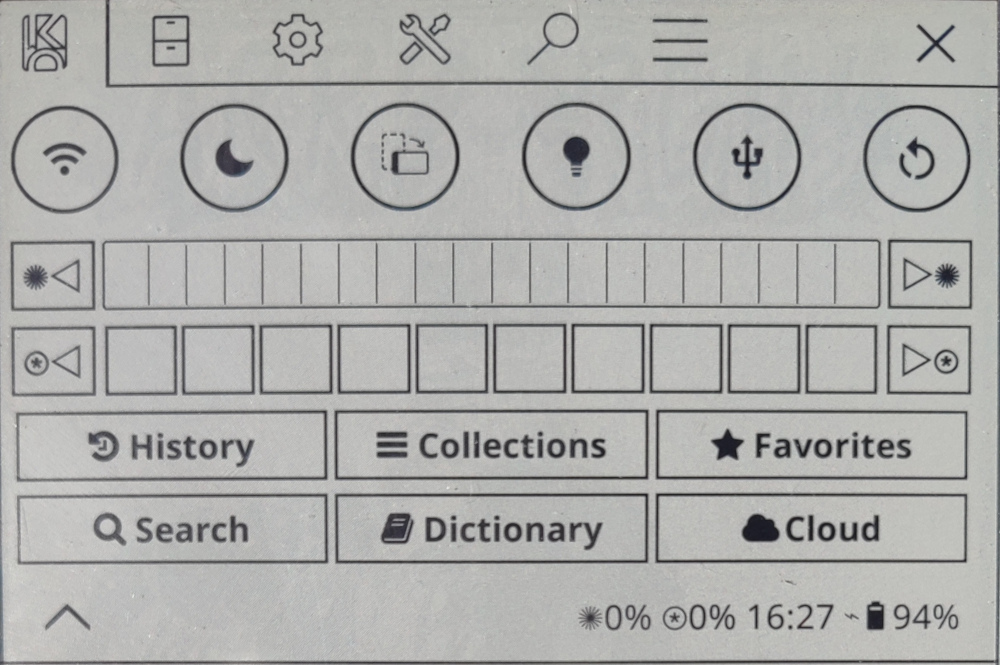
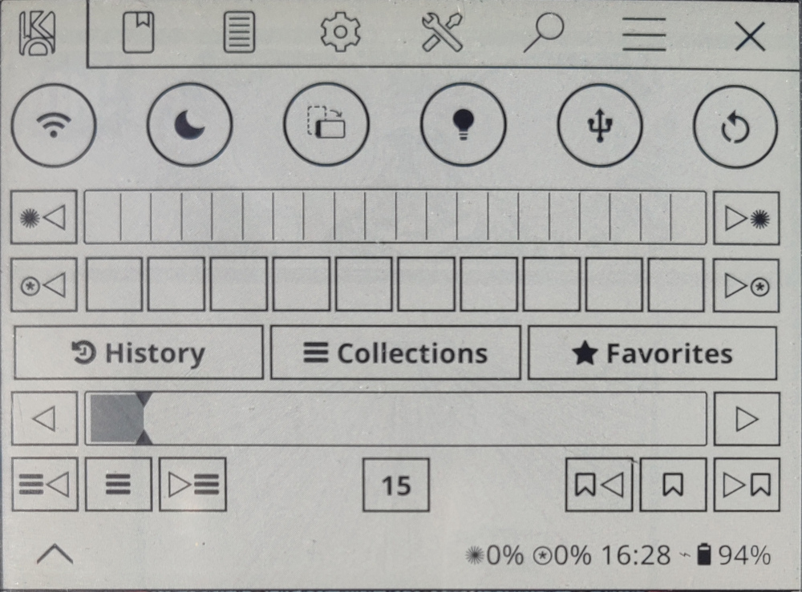
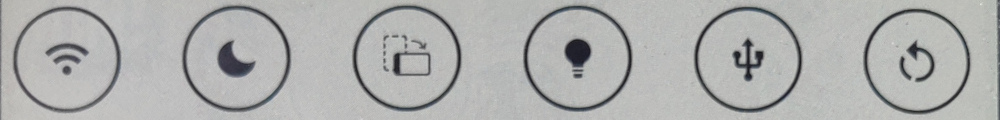
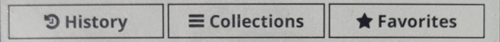
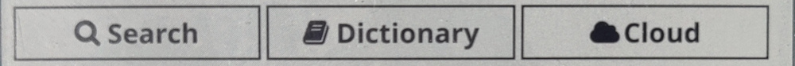
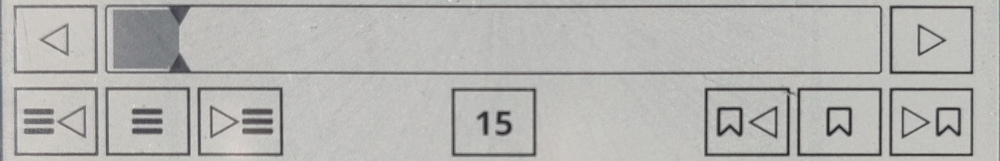

# koreader-quick-settings-advanced

Advanced version of quick-settings patch from qewer33. Mix of personnal and others forks ideas.

**In filemanager :**

**In reader :**

## Installation

Drop the `patches/***.lua` files into your `koreader/patches/` directory. Place all the icons in the `icons/` folder in your KOReader `icons/` directory.

## Patches

# 2-quick-settings.lua
  
Adds a Quick Settings tab as the first tab in the KOReader top menu.
Provides a fast access to common actions and device controls without navigating through menus.

**Actions :** In Filemanager and reader views

| Action | Label | Indicator | Tap | Hold | Default |  |
|:--------|:-------:|:-------:|:-------:|:-------:|:-------:|:-------:|
| Wifi | SSID | When connected | Toggle and connect wifi | Toggle and launch wifi picker | [x] | Core |
| Night |  | When enabled | Toggle night mode |  | [x] | Core |
| Light |  | When enabled | Toggle frontlight |  | [x] | Core |
| Rotate |  | When lock | Rotate screen | Lock rotation | [x] | Core |
| USB |  |  | Toggle mass storage |  | [x] | Core |
| Restart |  |  | Restart Koreader (with confirmation) |  | [x] | Core |
| Exit |  |  | Exit Koreader (with confirmation) |  | [ ] | Core |
| Sleep |  |  | Suspend device |  | [ ] | Core |
| SSH |  | When enabled | Toggle SSH server |  | [ ] | Core plugin |
| Calibre |  | When enabled | Toggle Calibre wireless connection |  | [ ] | Core plugin |

**Frontlight :** In Filemanager and reader views

| Frontlight | Tap | Hold |
|:-------- |:--------:|:--------:|
| Intensity - | Decrease intensity by 1% | Set intensity to 0% (off) |
| Intensity + | Increase intensity by 1% | Set intensity to 100% (max) |
| Warmth - | Decrease warmth by 10% | Set warmth to 0% (off) |
| Warmth - | Increase warmth by 10% | Set warmth to 100% (max) |

**Locations :** In Filemanager and reader views

| Location | Tap | Hold |
|:-------- |:--------:|:--------:|
| History | Open history | Open last(fm)/previous(rd) document  |
| Collections | Open collections |  |
| Favorites | Open favorites |  |

**Search :** In Filemanager view

| Search | Tap | Hold |
|:-------- |:--------:|:--------:|
| Search | Search file | Search Calibre metadata |
| Dictionary | Search dictionary | Search wikipedia |
| Cloud | Show cloud storage | Show OPDS catalog |

**Skim :** In reader views

| Skim | Tap | Hold |
|:-------- |:--------:|:--------:|
| Page - | Decrease page by 1 | Set page to first |
| Page + | Increase page by 1 | Set page to last |
| Chapter - | Decrease chapter by 1 | Set chapter to first |
| Chapter toogle | Show table of contents | Show book map |
| Chapter + | Increase chapter by 1 | Set chapter to last |
| Bookmark - | Decrease bookmark by 1 | Set bookmark to first |
| Bookmark toogle | Toogle bookmark | Show bookmark |
| Bookmark + | Increase bookmark by 1 | Set bookmark to last |

**Settings :**

The Quick Settings patch can be configured from **Settings" (Gear icon) -> "Quick settings** :

- **Select actions controls** :
- **Arrange actions** : submenu: toggle individual buttons, drag to reorder
- **Show actions controls labels** :
- **Show frontlight controls** :
- **Show warmth controls** :
- **Show location controls** :
- **Show search controls** :
- **Show skim controls** :
- **Always open on this tab** : option to default to Quick Settings when the menu opens

# 2-menu-size.lua

Increase the max size of the menu from 10 to 20 to use all the vertical space available.

# 2-exit-button.lua

**In filemanager :** Add an exit button with the standard cross icon at the left size of the top menu. This exit button close the top menu.

**In reader :** move the existing filemanager button to the left size of the top menu and change his icon with standard cross icon. This exit button close the reader and open the filemanager.

## Patch Settings

The Quick Settings patch can be configured from "Settings" (Gear icon) -> "Quick settings".

